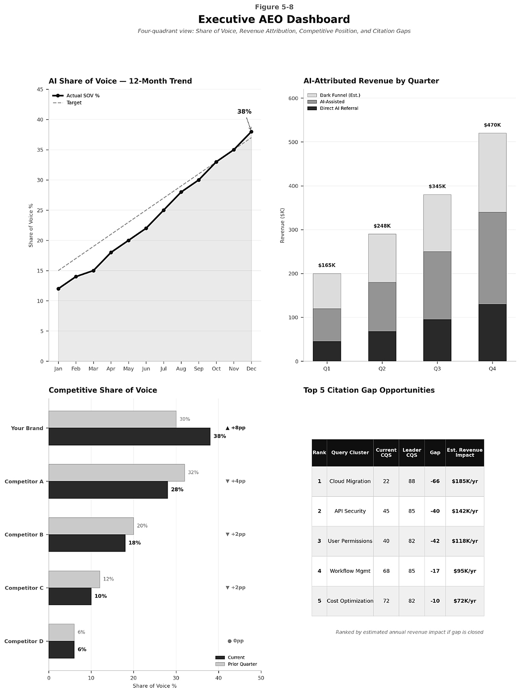
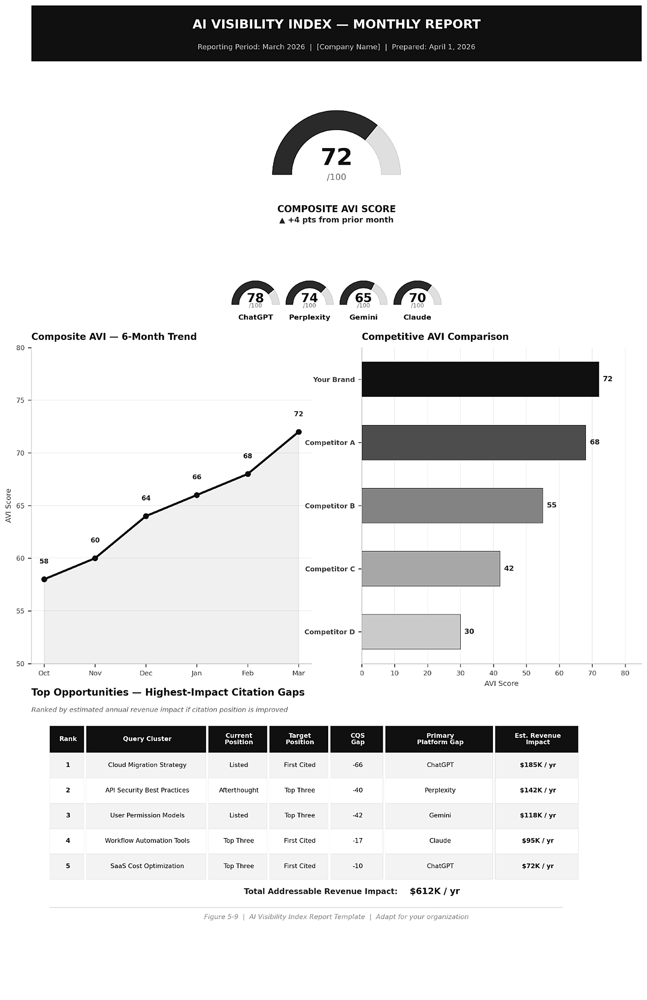

# Chapter 5 — _(Chapter Title)_

Code samples, figures, and reference assets for Chapter 5 of *Answer Engine Optimization* (O'Reilly).

## Figures

| File | Figure # in book | Description |
|---|---|---|
| [`images/figure-5-7-executive-aeo-dashboard.png`](images/figure-5-7-executive-aeo-dashboard.png) | Figure 5.7 | Executive AEO Dashboard — four-quadrant view of Share of Voice (12-month trend), AI-Attributed Revenue by quarter, Competitive Share of Voice, and Top 5 Citation Gap Opportunities |
| [`images/figure-5-8-ai-visibility-index-report.png`](images/figure-5-8-ai-visibility-index-report.png) | Figure 5.8 | AI Visibility Index — Monthly Report template: composite AVI score, per-platform breakdown (ChatGPT, Perplexity, Gemini, Claude), 6-month trend, competitive comparison, and top citation gap opportunities |

## Preview

## Notes

The figure labels baked into the source artwork read "Figure 5-8" and "Figure 5-9" — these are labeling errors in the original images. The correct in-book references are **Figure 5.7** and **Figure 5.8** respectively.
